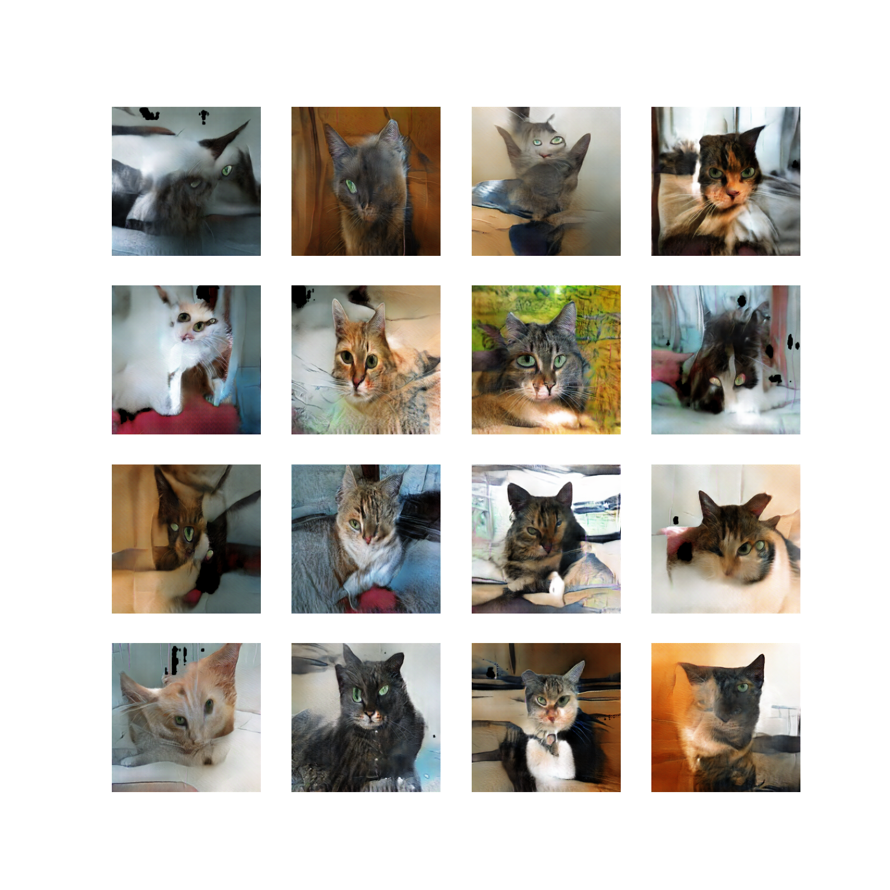
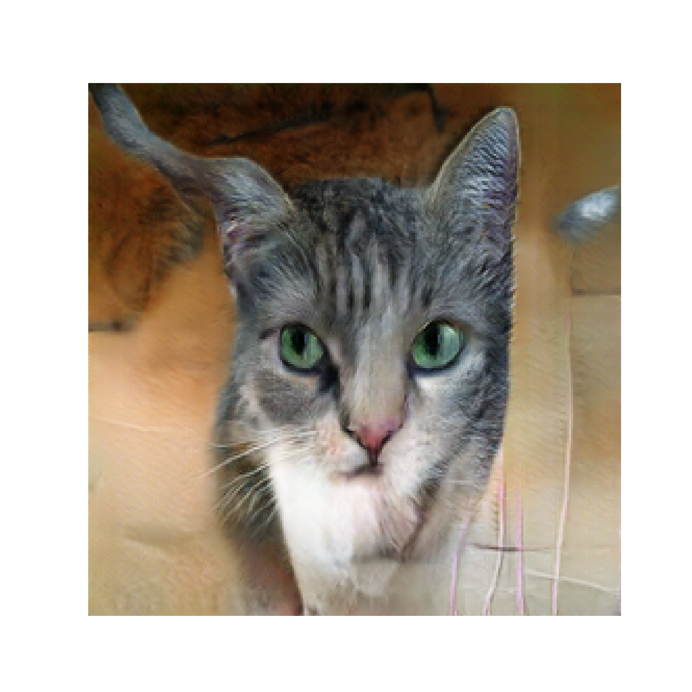
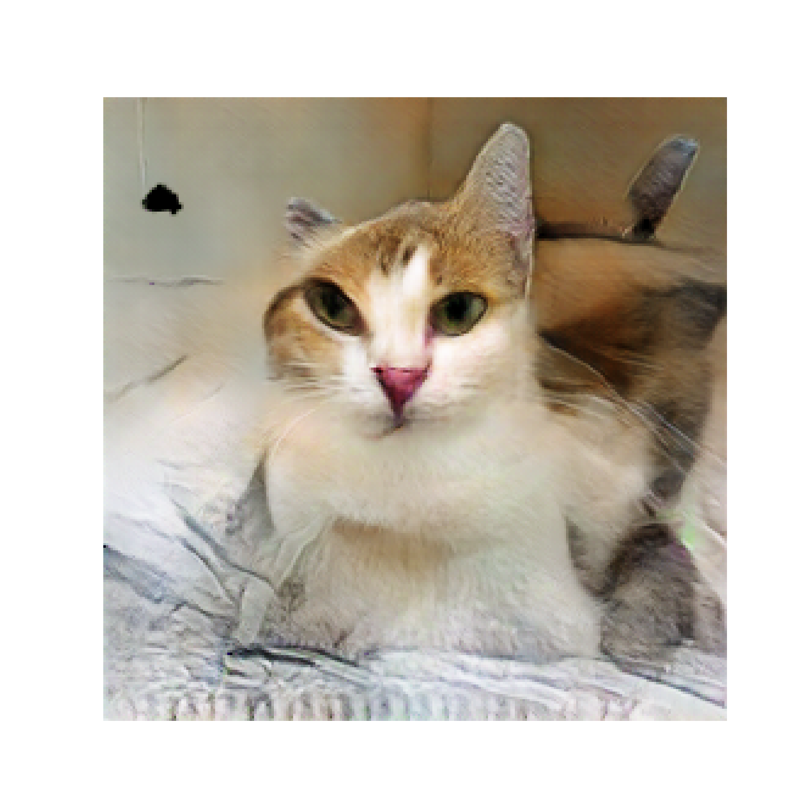

# Developing deep convolutional generative adversarial network to generate images of cats from their photos

code from engineer's degree thesis 

couldnt add checkpoints due to their weight

the dataset was created from 2 datasets from kaggle, then majority of the pictures were deleted, leaving only the ones where the cat was very well visible, then multiple augmentations were done to extend the size of the dataset from 5.6k images to about 125k images

## Sample results (30 epochs)

